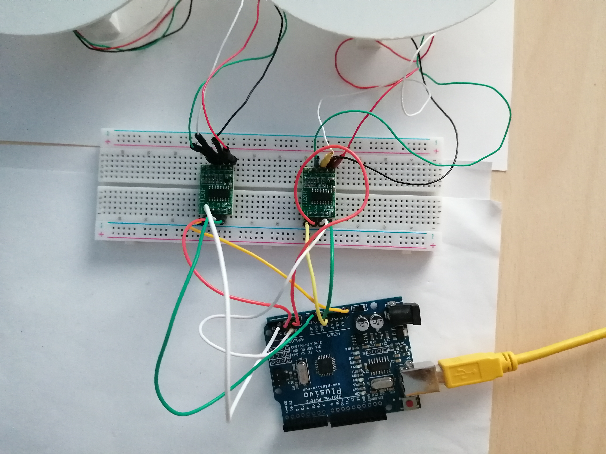
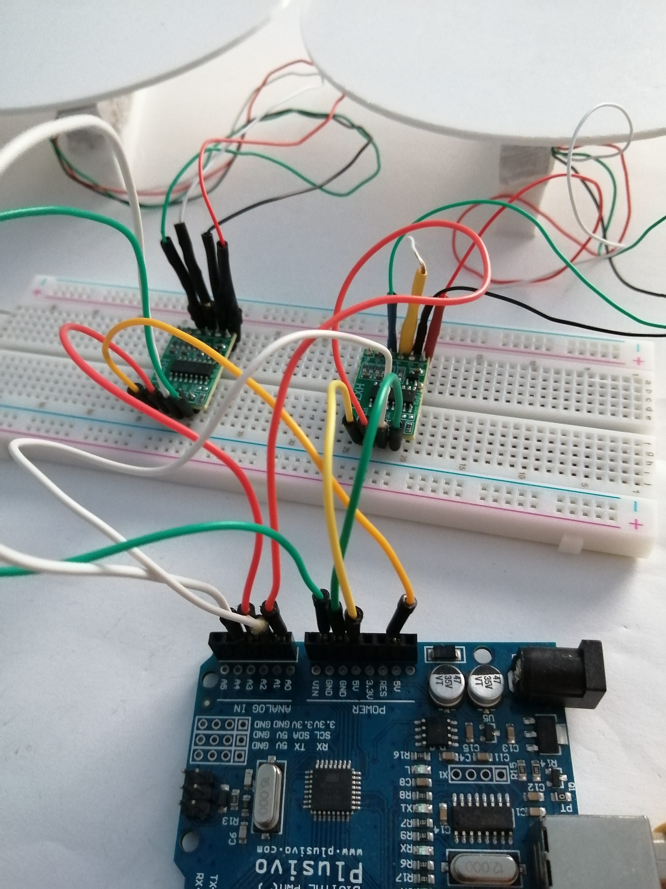

# Load Cell GUI

## Description
This Python code provides a graphical user interface (GUI) for displaying the output values from load cells. 

## Prerequisites
- Python 3.x
- Tkinter library (included in Python standard library)
- Arduino
- 2 load cells
- 2 HX711 modules
- breadboard
- USB cable for Arduino
- connecting wires

## Arduino, load cells, breadboard and wires
Configuration:
    Load cell -> HX711:
        red   -> E+
        black -> E-
        white -> A-
        green -> A+
    
    1st HX711 -> Arduino:
        GND -> GND
        DT  -> A1
        SCK -> A0
        VCC -> 5V
    
    2nd HX711 -> Arduino:
        GND -> GND
        DT  -> A3
        SCK -> A2
        VCC -> 5V
    
    Arduino -> USB cable -> your machine (Virtual Machine on laptop, e.g.)

IMAGES:

## Usage
Upload code to Arduino:
- in Visual Studio Code go to 2_scales_calibration.ino file
- on top right side click icon Arduino:Upload

Start GUI:
- go to folder in Terminal: ...arra-loadcell/2_scales_calibration/src/Python 
- type: python3 main.py
- the GUI is displayed: 

Buttons:
- Start Measurements -> start displaying measurements from scales
- Stop Measurements  -> stop displaying measurements from scales
- Clear              -> clear the textbox
- Calibrate          -> calibrate the scales with the set weight:
    - set weight: 6.1 g
    - object: 50 bani coin
    
    - after click, a message box appears: 
    - put objects on scales
    - click OK

Close GUI:
- X button on top right of GUI window
