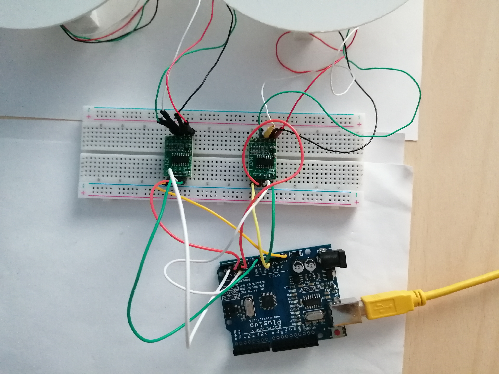
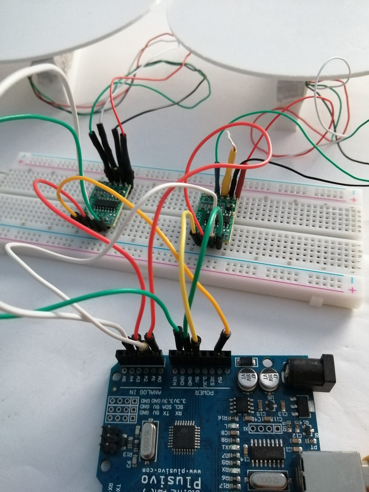
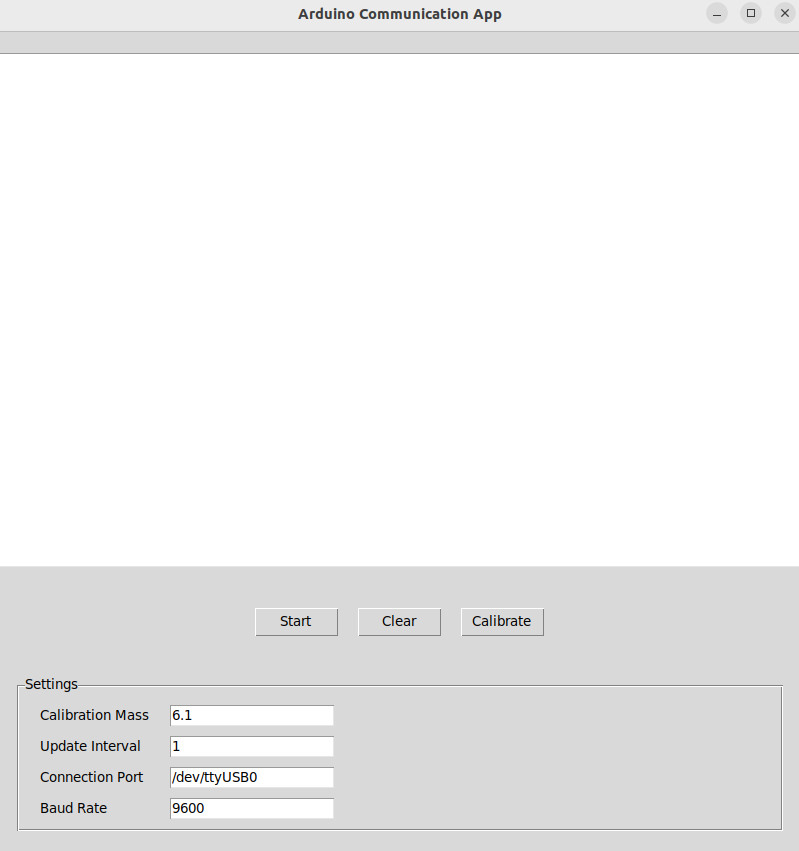
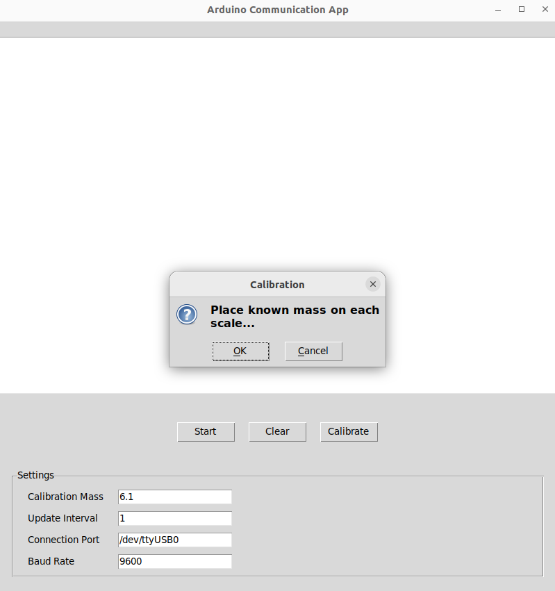

# Load Cell GUI

## Description
This Python code provides a graphical user interface (GUI) for displaying the output values from load cells. 

## Prerequisites
- Python 3.x
- Tkinter library (included in Python standard library)
- Arduino
- 2 load cells
- 2 HX711 modules
- breadboard
- USB cable for Arduino
- connecting wires

## Arduino, load cells, breadboard and wires
Configuration:
    Load cell -> HX711:
        red   -> E+
        black -> E-
        white -> A-
        green -> A+
    
    1st HX711 -> Arduino:
        GND -> GND
        DT  -> A0
        SCK -> A1
        VCC -> 5V
    
    2nd HX711 -> Arduino:
        GND -> GND
        DT  -> A4
        SCK -> A5
        VCC -> 5V
    
    Arduino -> USB cable -> your machine (Virtual Machine on laptop, e.g.)

IMAGES:

## Usage
Upload code to Arduino:
- in Visual Studio Code go to arduino.ino file: ...arra-loadcell/app/arduino/arduino.ino
- on top right side click icon Arduino:Upload

Start GUI:
- go to app folder in Terminal: ...arra-loadcell/app
- type: python3 main.py
- the GUI is displayed: 

Buttons:
- Start     -> start displaying measurements from scales
- Stop      -> stop displaying measurements from scales
- Clear     -> clear the textbox
- Calibrate -> calibrate the scales with the set weight:
    - set weight: 6.1 g
    - object: 50 bani coin
    
    - after click, a message box appears: 
    - put objects on scales
    - click OK

Settings:
- Calibration Mass: 6.1          (mass of object in grams)
- Update Interval:  1            (milliseconds between displayed values)
- Connection Port:  /dev/ttyUSB0 (port for USB cable to Arduino)
- Baud Rate:        9600         (bits per second transmitted between devices)

- If Settings change: press Start to apply changes

Close GUI:
- X button on top right of GUI window